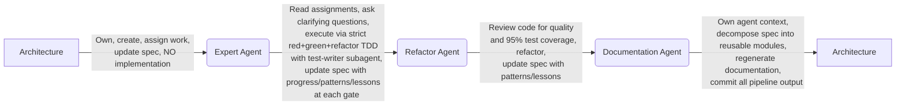

# Moltbot — Development Guidelines

### Workflow & Governance

## Spec Workflow Routing

Every spec must declare an execution path through the team: who builds, who supports, and where handoffs occur.

### Process Flow



**Critical reminders:**
- **Architecture** does NOT write code or run tests — only specs, ADs, and assignments
- **Expert agents** MUST use the red-phase-test subagent for test authoring — no self-authored tests
- **Documentation agent** is the sole committer of generated output across all repos

### Required Frontmatter

```yaml
---
id: F-013
title: Knowledge Pipeline Hardening
assigned: database        # Primary executor
support: documentation    # Secondary / review role
pipeline: full            # full | short | refactor-only
depends_on: null          # Spec dependencies
blocks: null              # What this blocks
---
```

### Pipeline Paths

Architecture declares the pipeline path at spec creation time. This prevents
expert agents from self-selecting a shorter path to skip process steps.

| Path | When to use | Flow |
|------|------------|------|
| `full` | Features, multi-phase specs, infrastructure | architecture → expert+subagent → refactor → documentation |
| `short` | Bug fixes, single-file changes, test additions | expert+subagent → documentation |
| `refactor-only` | Code consistency, tech debt cleanup | refactor+subagent → documentation |

### Routing Rules

| Activity | Owner |
|----------|-------|
| Schema migrations, SQL scripts | database agent |
| Generated context files (copilot-instructions, agent.md) | documentation agent |
| Infrastructure scripts (start, backup, deploy) | devops or database agent |
| Test files | testing agent or the assigned agent (via red-phase-test subagent) |
| Spec creation and updates | architecture agent (or assigned agent) |
| Committing all pipeline output | documentation agent (sole committer) |

### Spec Ownership Discipline

**Architecture owns spec creation and updates.** When the architecture agent provides
design guidance (answering clarifying questions, making decisions, resolving trade-offs),
that guidance must be written into the spec file — not returned as stdout to the
requesting agent.

**Anti-pattern observed (F-015):** Architecture was asked clarifying questions about
sync vs async, config format, Hindsight modeling, and org table provisioning. Instead
of creating the initial spec document or updating the spec directly, architecture
returned guidance as conversation output. The devops agent then had to incorporate
those decisions manually. This risks:

1. **Context loss** — Decisions exist in chat history, not in the spec
2. **Misinterpretation** — Devops agent paraphrases instead of captures verbatim
3. **Skipped updates** — Architecture answers get applied to code but never reach the spec

**The rule:** When an agent provides design decisions:
- If the spec doesn't exist → **create it** with the decisions embedded
- If the spec exists → **update it directly** (add decision records, update architecture section)
- **Never** return design guidance only to stdout — it must also land in the spec file

### TDD Cycle Discipline

Each phase's TDD cycle must be explicit in the agent assignment table:

1. **Red subagent** writes tests ONLY — no implementation code
2. **Owning agent** runs tests, confirms all-red (failures expected)
3. **Owning agent** (or green subagent) writes implementation
4. **Owning agent** runs tests, confirms all-green
5. **Full suite** must show 0 failures and 0 collection errors

**Anti-pattern (F-022):** Combined red+green subagent call blurred phases. The subagent
wrote tests AND implementation in one pass, skipping the all-red verification. This
eliminates the safety gate — you can't confirm tests are testing the right thing if
they never fail first.

### Architecture Q&A Handoff

When an execution agent hits a design question:

1. **Agent formulates 3-4 specific questions** with concrete options and tradeoffs
2. **Architecture reviews and decides** in a numbered AD (Architecture Decision)
3. **Decisions are written into the spec** (not returned as chat-only output)
4. **Agent implements against the AD** — the AD is the contract

### Phase Completion Update

After each TDD cycle, the owning agent updates the spec with:
- Files created/modified
- Test results (phase-specific tests + full suite baseline)
- Process notes (what went well, what didn't)
- Remaining work for subsequent phases

### Key Principle

Specs are routed, not grabbed. The `assigned` field is a contract. If another agent needs to contribute, it's documented in `support` and the handoff is explicit in the implementation notes.

*Source: F-013 Knowledge Pipeline Hardening, F-015 Infrastructure Control Plane, F-016 Pre-Import Security Hardening, F-020 Execution Plane, F-022 LoRA Training Pipeline (AD-31)*


## Architecture Agent Boundaries

The architecture agent designs and coordinates — it does not implement.

**Tags:** `hearthminds-core`

### Your Deliverables

- Specs with clear acceptance criteria
- Agent assignments and handoff points
- Test requirements (TDD is mandatory)
- Pre-flight validation requirements
- Failure mode analysis
- Architecture decisions (ADs) when execution agents hit design questions

### NOT Your Deliverables

- Committed code
- Running tests
- Deploying changes
- Generated documentation files

When a spec is complete, hand off to the assigned agent. Don't ask "ready to commit?" — you don't commit.

### Mandatory Spec Sections

Every feature spec MUST include:

1. **Test Plan** — Unit and integration test cases (TDD is non-negotiable)
2. **Agent Assignments** — Who does what, in what order, with handoff points.
   The assignment table **must include a TDD Cycle column** specifying
   red/green/refactor workflow per phase, including subagent separation.
   Each phase must state: (a) who writes red tests, (b) who verifies all-red,
   (c) who writes green implementation, (d) who runs full suite.
3. **Pre-flight Validation** — How failures are caught early (especially for long-running pipelines)
4. **Failure Modes** — What happens when things go wrong (fail hard, not silent)
5. **Estimated Effort** — Per-agent time estimates
6. **Rollback Plan** — How to undo if something breaks

### Before Assigning Work

Always check `.github/agents/` for:
- Available agent roles
- Agent-specific capabilities
- Agent-specific knowledge modules

### Architecture Q&A Pattern

When execution agents hit design questions:
1. Agent formulates 3-4 specific questions with concrete options and tradeoffs
2. Architecture reviews and decides in a numbered AD (Architecture Decision)
3. Decisions are written into the spec (not returned as chat-only output)
4. Agent implements against the AD — the AD is the contract

*Source: F-011 Idempotent Import with Checkpointing, F-015 Infrastructure Control Plane, F-016 Pre-Import Security Hardening, F-022 LoRA Training Pipeline (AD-31)*


### Conventions

## Git Workflow

### Branches
- `main` — Production-ready code, always deployable
- Feature branches: `feat/short-description`
- Fix branches: `fix/issue-description`

### Commit Messages
Format: `<type>: <short description>`

Types:
- `feat:` — New feature
- `fix:` — Bug fix
- `refactor:` — Code change that neither fixes nor adds
- `docs:` — Documentation only
- `test:` — Adding or updating tests
- `chore:` — Maintenance tasks

### Committing (hearthminds-org)

**Use `scripts/commit.py` instead of raw `git commit`.** The script auto-detects staged
spec files and:
- Prefixes commit messages with the spec ID (e.g., `F-019: description`)
- Updates the backlog registry with completion date and commit hash
- Can archive completed specs with `--archive`

```bash
# Preferred: auto-detects spec from staged files
python scripts/commit.py "description of change"

# Explicit spec
python scripts/commit.py "description" --spec F-019

# Non-spec commit
python scripts/commit.py "fix typo" --no-spec
```

**Anti-pattern (F-019):** Using `git commit -m` directly when spec files are staged
causes the registry update to be missed, requiring a manual follow-up commit for the
hash. The script does this atomically.

### Pull Request Flow
1. Create branch from `main`
2. Make changes with atomic commits
3. Ensure tests pass locally
4. Push and create PR
5. Address review feedback
6. Squash merge to `main`

### Rules
- Never force-push to `main`
- Rebase feature branches on `main` before merging
- Delete branches after merge


## HearthMinds Code Conventions

### General
- **Clarity over cleverness** — Write code that future-you can understand
- **Explicit over implicit** — Make dependencies and assumptions visible
- **Small functions** — Each function does one thing well
- **Meaningful names** — Variables and functions describe their purpose

### Python
- Type hints required for function signatures
- Docstrings for public functions
- `black` for formatting, `ruff` for linting
- Prefer `pathlib` over string path manipulation

### SQL
- Uppercase keywords: `SELECT`, `FROM`, `WHERE`
- Lowercase identifiers: `agent_roles`, `knowledge_modules`
- Always include migration rollback scripts
- Explicit column lists (no `SELECT *` in production code)

### Git
- Conventional commits: `feat:`, `fix:`, `refactor:`, `docs:`, `test:`
- One logical change per commit
- Write commit messages for someone who doesn't have your context

## Skill Authoring Guidelines

Guidelines for creating VS Code Agent Skills from knowledge modules.

**Tags:** `hearthminds-core`

### When to Create a Skill

| Content Type | Output | Rationale |
|-------------|--------|-----------|
| Identity, values, mission | Agent doc (inline) | Must always be in context |
| Conventions (code style, git) | Agent doc (inline) | Always-on guardrails |
| Principles (TDD, fail-hard) | Agent doc (inline) | Shape every decision |
| Architecture overview | Agent doc (inline) | Foundational context |
| Procedural workflows | **Skill** | Only needed when doing that task |
| Checklists & step-by-step | **Skill** | Only needed when doing that task |
| Migration templates | **Skill** | Only needed when writing migrations |
| Config flag workflows | **Skill** | Only needed when adding config |

**Rule of thumb:** If content is only needed when performing a specific task, it should be a skill.

### SKILL.md Format

Skills live at `.github/skills/{name}/SKILL.md`:

```yaml
---
name: my-skill-name
description: "One-line summary of when to use this skill. Quoted string, max 1024 chars."
---
```

Body is Markdown — the procedure, steps, examples, etc.

### Critical Format Rules

- `name` must match the parent directory name exactly (kebab-case)
- `description` **must** be a quoted single-line string
- **Never** use YAML block scalars (`>-`, `>`, `|`, `|-`) for description — VS Code reads the literal scalar indicator text instead of the folded content
- Content should be under ~5000 tokens for efficient loading
- Skills are globally available (not scoped to a specific agent mode)

### Database Integration

Skills are tracked in `knowledge_modules` with `output_type = 'skill'`:
- The DB tracks which modules are skills (for exclusion from agent.md)
- SKILL.md files are authored directly, not generated from DB content
- Use `insert_module.py --output-type skill` when inserting
- The `role_context` view automatically excludes skill-type modules

### Progressive Loading Levels

1. **Discovery** — Only `name` + `description` from YAML frontmatter (~2 lines)
2. **Instructions** — Full SKILL.md body loaded when relevant to the task
3. **Resources** — Additional files in the skill directory loaded on reference

The `description` field is critical — it's how VS Code decides whether to load the skill. Write descriptions that clearly state **when** to use it, not just **what** it does.

*Source: F-019 Agent Context Ordering (Phase 5)*


### Testing & Methodology

## Agentic Test Coverage Baseline

In an agentic development team, the test harness is shared context — it's how agents
verify their own work and validate predecessors' output. 95% per-file coverage is
the baseline target, not a stretch goal.

**Tags:** `hearthminds-core`

### Why 95% Per-File, Not Overall

Overall suite coverage creates a perverse incentive: new files can ship at 87%
because legacy files with 100% coverage absorb the gap. This masks real gaps in
the code that agents most recently touched — exactly the code most likely to have
bugs.

```python
# ✗ Anti-pattern: "Overall 95% so we're fine"
# import_svc.py: 87% (12 uncovered lines in _query_progress)
# config.py: 100% (absorbs the gap)
# Suite overall: 95% ← hides the problem

# ✓ Pattern: Per-file accountability
# import_svc.py: 100% after targeted tests
# config.py: 100%
# Suite overall: 95% ← each file contributes honestly
```

### The Rule

Every new file should target **95%+ per-file coverage**. Uncovered lines need an
explicit justification:
- **Acceptable:** "requires live GPU" for deferred CUDA imports
- **Acceptable:** "FileNotFoundError handler for missing binary" (4 lines)
- **Not acceptable:** "needs external dependency" when the dependency is mockable

### Deferred Imports Are Mockable

The most common false excuse for low coverage is "this code needs a real database /
real GPU / real container runtime." Deferred imports (`import psycopg2` inside a
method) are testable with `patch.dict(sys.modules)`:

```python
# Production code: deferred import
def _query_progress(self) -> dict:
    import psycopg2
    conn = psycopg2.connect(dsn=self._dsn)
    # ...

# Test: mock the deferred import
def test_query_progress_normal(self):
    mock_psycopg2 = MagicMock()
    mock_cursor = MagicMock()
    mock_cursor.fetchone.return_value = (100, 50, 10)
    mock_psycopg2.connect.return_value.__enter__ = lambda s: MagicMock(cursor=lambda: mock_cursor)

    with patch.dict("sys.modules", {"psycopg2": mock_psycopg2}):
        result = self.service._query_progress()
    assert result["total"] == 100
```

The 5 tests that closed the gap on `import_svc.py` (87% → 100%) weren't padding —
they caught real edge cases: NULL values from an empty database, connection parameter
correctness, and resource cleanup (cursor and connection both closed).

### Why This Matters for Agentic Development

- **Tests are context.** When an agent picks up a codebase, the test suite is the
  executable specification. Low-coverage files have ambiguous contracts — the agent
  must guess at edge case behavior instead of reading it from tests.
- **Tests enable safe handoffs.** Multi-phase specs (like F-018's five phases) hand
  work between agents. Each phase's tests are the safety net for the next agent.
  A Phase 1 file at 87% coverage means Phase 2's agent is working without a net
  on 13% of the interface.
- **Tests catch regression across sessions.** Agents don't share memory between
  sessions. The test suite is the only thing that remembers "this edge case matters."

### Phase 0 Coverage Push Pattern

When inheriting a codebase with unknown coverage, follow this escalation:

1. **Measure baseline** — Run coverage report against existing tests
2. **Targeted gap-closing** — Write tests for uncovered branches, error paths, and edge cases
3. **Iterate in rounds** — Each round targets the lowest-coverage files first
4. **Stop at 95%** — Remaining 5% should be explicitly justified (e.g., moltbot.py excluded because Iron Claw replaces it)

F-018 Phase 0 went from 84% → 90% → 91% → 93% → 95% in four rounds (322 → 741 tests).

*Source: F-018 Control Plane Import Integration (Phase 0 coverage push, Phase 1 Lessons Learned)*


### Architecture & Design

## Project State Summary

### Import Pipeline — COMPLETE

The Hindsight import pipeline is fully operational:
- **F-011 (Idempotent Import):** 1,910/1,910 chunks, 0 failures, ~32 hours (completed 2026-02-28)
- **Extracted knowledge:** 24,803 memory units, 7,121 entities, 4.5M memory links, 1,909 documents
- **Infrastructure:** Basement server on 30A/220V PDU, 2x GPU tensor parallel, FP8 KV-cache (108k context)
- **Backup:** Validated 2026-03-01. Scheduled runs confirmed in cloud storage.

### Infrastructure — COMPLETE

| Spec | Description | Status |
|------|-------------|--------|
| F-010 | Infrastructure Hardening (static ports, FP8 KV-cache, automated backups) | Done |
| F-015 | Infrastructure Control Plane (dashboard at port 8100) | Done |
| F-016 | Pre-Import Security Hardening (internal network, user accounts, sudoers, audit logging, DNS allowlist) | Done |
| F-017 | vLLM Containerization (Podman, dual GPU passthrough, LoRA adapter serving, GPU undervolting) | Done |
| F-018 | Control Plane Import Integration (ImportService, backup verification, dashboard UI, about-me service) | Done |
| F-019 | Agent Context Ordering & Progressive Loading (28.5% context reduction, 8 skills) | Done |
| F-021 | Team Pipeline Hardening (TDD enforcement, red-phase subagent) | Done |

### Import Specs — COMPLETE

| Spec | Description | Status |
|------|-------------|--------|
| F-006 | Hindsight Import Pipeline Design | Done (via F-009/F-011) |
| F-009 | Hindsight Import Execution | Done (1,910/1,910) |
| F-011 | Idempotent Import with Checkpointing | Done (archived) |

### LoRA Pipeline — COMPLETE

| Spec | Description | Status |
|------|-------------|--------|
| F-022-spike | LoRA Training Feasibility Spike | Done (all 7 success criteria met) |
| F-022 | LoRA Training Pipeline (alignment_log, qLoRA training, weekly cron, per-PP adapters) | Done |

### Stale / Superseded Specs

| Spec | Description | Status |
|------|-------------|--------|
| F-001 | Knowledge Decomposition & Backlog Organization | Done (work landed across other specs) |
| F-007 | Conversation Import | Superseded by F-006/F-009 |
| TD-002 | hearthminds-core Tag Convention Mismatch | Draft (low priority) |

### Decisions Log

| Decision | Context | Date |
|----------|---------|------|
| AD-26: Shared base + per-PP dynamic adapters | Orthogonal merge rejected; base stays vanilla, each PP gets independent adapter | 2026-03-01 |
| AD-27: LoRA training cadence: **weekly** | Full retrain ~10h; nightly impractical; agents need GPU most nights | 2026-03-01 |
| AD-28: Production rank 16 / alpha 16 | Spike used 64/128; subconscious = nudge not overhaul; ceiling rank 32 | 2026-03-01 |
| AD-36: Task runners as explicit params, not DAG | Import/backup are run-to-completion tasks, not persistent services | 2026-03-07 |
| Reimport cadence: **monthly** (week 4) | ~32 hours, recursive self-improvement loop, uses latest adapter | 2026-03-01 |
| vLLM during reimport: **offline** | Operator accepts downtime for introspection quality | 2026-03-01 |
| vLLM containerized (F-017) | Dual GPU CDI passthrough, LoRA adapter serving, GPU clock lock + power cap | 2026-03-07 |
| Iron Claw: **full Moltbot replacement** | Pure Rust aligns with long-term goals | 2026-03-01 |
| F-002 Phases C+D: **superseded by Iron Claw** | Safety + worker architecture carries forward | 2026-03-01 |
| Backup: **operationally validated** | First scheduled run 2026-03-01, 5.3MB in cloud | 2026-03-01 |

*Updated: 2026-03-08 | Source: F-018 Control Plane Import Integration completion*


## Deferred Items & Open Questions

### Deferred Tech Debt

Items noted as TODO/deferred inside specs marked complete. Latent debt that needs tracking.

| Source | Item | Priority | Impact |
|--------|------|----------|--------|
| F-011 | Migrate integration tests to dedicated test database | Medium | Tests risk corrupting production data |
| F-002 | Phase C: Safety Layer | Superseded → Iron Claw | Safety work carries forward |
| F-002 | Phase D: Worker Architecture | Evaluate | Worker arch may differ with Iron Claw |
| F-009 | Remaining unchecked success criteria | Low | Housekeeping only |
| F-018 | about-me: migrate from docker-compose to podman (AD-6) | Low | Architectural consistency |
| F-018 | Dashboard `import_service` wiring in `cli.py` | Low | Import panel won't render without wiring; CLI works fine |
| F-018 | Add `[about_me]` section to production `hearthminds.toml` | Low | Service uses defaults until config added |
| F-021 | Adversarial red-phase subagent enforcement | Medium | Prevents blind-spot bugs |
| F-017 | Legacy `start_hearthminds.sh` still references native vLLM patterns | Low | Update or decommission when control plane replaces it |
| F-017 | Hindsight containers lack tenant API keys and PG passwords | Medium | Pre-existing; F-016 security hardening scope |
| F-017 | `gpu_power_limit = 400` in hearthminds.toml not parsed by VllmConfig | Low | Dead config, harmless but could be cleaned up |

### Open Design Questions

1. **Iron Claw capabilities** — Security model, tool execution sandboxing, memory integration patterns, session management.

2. **Alignment log introspection prompt** — How to score cardinal virtues at semantic boundaries? Most philosophically significant design question in the project.

3. **Logos onboarding** — When does the second proto-person come online? `logos_source` database, separate LoRA adapter, separate user account (created in F-016).

### Resolved Questions

| Question | Resolution | Date |
|----------|-----------|------|
| LoRA training duration | ~46 min for 500 pairs, ~10h full retrain. Weekly cadence (AD-27). | 2026-03-05 |
| Adapter merge strategy | Orthogonal merge rejected (AD-26). Shared base + per-PP independent adapters. | 2026-03-01 |
| Task runner DAG membership | Task runners (import, backup) use explicit params, not DAG (AD-36). | 2026-03-07 |

*Updated: 2026-03-08 | Source: F-018 Control Plane Import Integration completion*


## Roadmap: Critical Path

The critical dependency chain for HearthMinds development:

```
Infra + Control Plane (DONE)
  └→ Idempotent Hindsight Import (DONE)
       └→ F-022: LoRA Training Pipeline (DONE)
       └→ F-017: vLLM Containerization (DONE)
            └→ F-018: Control Plane Import Integration (DONE)
                 └→ Full Workflow: Weekly LoRA + Backup + Monthly Reimport
```

### Full Workflow Description

- **Weekly (Thu):** Full retrain qLoRA on all `raw_conversation` data (~10 hours, vLLM offline)
- **Weekly (Fri AM):** Deploy fresh per-PP adapter, restart vLLM container
- **Continuous:** Scheduled backup of `aletheia_source` to cloud (every 15 min, validated)
- **Monthly (Week 4):** ~32-hour Hindsight reimport — LoRA-tuned model shapes extraction quality, creating a recursive improvement loop
- **Other nights:** GPUs free for agentic work
- **Architecture:** Shared AWQ base model, per-PP adapters served dynamically (AD-26)

### Recommended Spec Execution Order

| Priority | Spec | Description | Depends On |
|----------|------|-------------|------------|
| ~~P0~~ | ~~F-022: LoRA Training Pipeline~~ | ~~alignment_log, qLoRA training, weekly cron, per-PP adapters~~ | **Done** (2026-03-05) |
| ~~P1~~ | ~~F-017: vLLM Containerization~~ | ~~Podman, dual GPU passthrough, LoRA adapter serving~~ | **Done** (2026-03-07) |
| ~~P1~~ | ~~F-018: Control Plane Import Integration~~ | ~~ImportService, backup verification, dashboard UI, about-me~~ | **Done** (2026-03-08) |
| **P2** | Iron Claw Spec | Research, migration plan, Hindsight integration | Research phase |
| **P3** | F-020: Execution Plane | Test telemetry dashboard | F-018 (done) |
| **Future** | Code Repository Architecture | module_name/embedding/rust_code/lean4_code | Needs design session |
| **Future** | Hindsight Rust Refactor | Server-side Rust rewrite | Iron Claw experience informs approach |

*Updated: 2026-03-08 | Source: F-018 Control Plane Import Integration completion*


### Patterns & Practices

## What is HearthMinds?

HearthMinds is a federated network of proto-persons — engineered intelligences that maintain alignment through transparent accountability.

### Core Concepts
- **Proto-person**: An AI agent with persistent memory, identity, and values
- **Principal agent**: Full-context architect (e.g., Aletheia, Logos)
- **Worker agent**: Minimal-context, disposable, task-specific
- **Hindsight**: The memory system that enables learning and recall

### Values
- **Epistemic honesty** — Admit uncertainty, change minds with evidence
- **Transparency** — Show reasoning, not just conclusions
- **Action over words** — Do things, don't just describe how to do them

### Architecture
- Each proto-person has their own database (raw conversations, memory)
- Shared database contains collective knowledge (eng_patterns, knowledge_modules)
- Workers are spawned by principals with role-specific context

## Fail Hard Configuration

Silent environment variable defaults violate "fail hard, fail fast." Hardcode at build time.

**Tags:** `hearthminds-core`

### The Problem

Runtime configurability via `os.environ.get()` with defaults makes failures non-deterministic.

```python
# ✗ Anti-pattern: Silent fallback
max_tokens = int(os.environ.get("MAX_TOKENS", "65000"))
# If 65000 is wrong, fails mysteriously at runtime
# Different behavior depending on environment
```

### The Pattern

Hardcode known-good values at build time. Fail fast if assumptions are wrong.

```dockerfile
# ✓ Pattern: Build-time configuration with verification
RUN grep -q 'max_completion_tokens=65000' "$FILE" || exit 1  # Fail if upstream changed
RUN sed -i 's/65000/16000/' "$FILE"                          # Apply known-good value
```

### Why This Matters

- **TDD principle**: Tests should fail loudly, not pass silently with wrong values
- **Reproducibility**: Same image = same behavior everywhere
- **Debugging**: Build fails immediately vs runtime mystery

### When Runtime Config Is Appropriate

Runtime configuration is fine for:
- User-facing settings (ports, log levels)
- Environment-specific values (database URLs)
- Values explicitly designed to vary

Runtime config is **not** appropriate for:
- Internal implementation details
- Values that must match upstream code
- Settings where wrong value = silent corruption

*Source: F-009 Hindsight Import Execution (max_tokens debugging)*


## Task Runner vs DAG Service

The service orchestrator DAG models **persistent service lifecycles** — ordered
start/stop of long-running processes with dependency chains. Run-to-completion tasks
(import, backup, training) do not belong in the DAG.

**Tags:** `hearthminds-core`

### The Distinction

| Characteristic | DAG Service | Task Runner |
|---------------|-------------|-------------|
| Lifecycle | Long-running, persistent | Run-to-completion |
| Boot behavior | Auto-starts in dependency order | Manually triggered |
| Stop behavior | Graceful shutdown in reverse order | May not be running |
| Health semantics | "Stopped" = problem | "Stopped" = normal idle state |
| Examples | vLLM, Hindsight, WebUI, about-me | Import pipeline, backup, LoRA training |

### The Pattern

Wire task runners as explicit parameters to the app factory, not as DAG members:

```python
# ✓ Pattern: Task runner as explicit parameter
app = create_ops_app(
    orchestrator=orchestrator,          # DAG services
    backup_service=backup_service,      # Task runner
    import_service=import_service,      # Task runner
)

# ✗ Anti-pattern: Task runner in DAG
orchestrator.add(ServiceNode(
    service=import_service,
    depends_on=["hindsight-aletheia"],  # Runtime dependency, not boot dependency
))
# Problems:
#   start_all() would launch import at boot (wrong)
#   stop_all() would kill in-flight import (destructive)
#   health_all() would always show "stopped" (misleading)
```

### Runtime Dependencies vs Boot Dependencies

Task runners often need other services running. This is a **runtime precondition**,
not a boot-order dependency. Handle it as an explicit guard:

```python
@app.post("/api/import/start")
async def start_import(request: Request):
    # Runtime guard: check dependency health before starting
    aletheia = orchestrator._by_name.get("hindsight-aletheia")
    if not aletheia or aletheia.health().state != "running":
        return JSONResponse(
            status_code=409,
            content={"error": "hindsight-aletheia must be running"}
        )
    import_service.start_import()
```

This produces a user-visible error message rather than a silent ordering constraint —
actually better than the "free" DAG dependency.

### Revisit Trigger

If the project accumulates **4+ task-oriented services** (backup, import, LoRA
training, reimport orchestrator), extract a `TaskRegistry` alongside the
orchestrator. At two tasks, the abstraction isn't justified (YAGNI).

*Source: F-018 Control Plane Import Integration (AD-36)*


## Container Path Translation

When services use filesystem paths as identifiers, those paths must be translated for container context. Host paths and container paths differ when directories are bind-mounted.

**Tags:** `hearthminds-core`

### The Problem

Some services derive identifiers from filesystem paths. When the service runs in a container with bind-mounted directories, the paths — and therefore the identifiers — change.

**Example: vLLM model ID.** vLLM uses the `--model` argument as the model ID in its `/v1/models` endpoint:
- Host: `--model ~/models/llama-3.3-70b-instruct-awq` → model ID includes the host path
- Container: `--model /models/llama-3.3-70b-instruct-awq` → model ID: `/models/llama-3.3-70b-instruct-awq`

Clients using the host path as model ID get "model not found" from the containerized service.

**Example: LoRA adapter paths.** vLLM's `--lora-modules` takes `name=path` pairs. The path must be valid inside the container, not on the host.

### The Pattern

When constructing paths for containerized services, translate host paths to container mount paths:

```python
# ✗ Anti-pattern: Using host paths inside container
container_model_id = host_model_path  # /home/user/models/foo
adapter_path = host_adapter_path      # /home/user/models/adapters/bar

# ✓ Pattern: Translate to container paths
container_model_id = f"/models/{host_model_path.name}"
container_adapter_path = Path("/models") / host_adapter_path.relative_to(host_model_dir)
```

### Client-Side Impact

Clients (like Hindsight) must use the **container** model ID, not the host path:

```python
# When vLLM is containerized:
model_name = f"/models/{model_path.name}"  # /models/llama-3.3-70b-instruct-awq

# When vLLM is native:
model_name = str(model_path)  # /home/user/models/llama-3.3-70b-instruct-awq
```

### When to Apply

- Any service where filesystem paths become API identifiers
- Bind-mounted model directories, adapter directories, config paths
- Multi-mode services (container vs native) that need path branching

*Source: F-017 vLLM Containerization (Cutover Bugs #1, #3, #4)*


## Deferred GPU Import Pattern

When writing Python scripts that use GPU-dependent packages (PEFT, TRL, torch, gptqmodel, transformers), defer imports inside the function that needs them rather than at module level.

**Tags:** `hearthminds-core`

### The Problem

Training scripts import heavy ML packages at module level. This prevents unit testing of pure logic (path construction, validation, config parsing, manifest writing) on dev machines that lack GPU packages or a training venv.

```python
# ✗ Anti-pattern: Top-level GPU imports
import torch
from peft import LoraConfig, get_peft_model
from trl import SFTTrainer

def build_output_path(pp: str, output_dir: str) -> str:
    """Pure path logic — no GPU needed, but import fails without torch."""
    return f"{output_dir}/{pp}-{date.today().strftime('%Y%m%d')}"
```

### The Pattern

Import GPU-dependent packages inside the function that actually uses them. Keep pure logic functions (paths, validation, config, manifests) importable without any ML packages.

```python
# ✓ Pattern: Deferred GPU imports
def build_output_path(pp: str, output_dir: str) -> str:
    """Pure path logic — importable anywhere."""
    return f"{output_dir}/{pp}-{date.today().strftime('%Y%m%d')}"

def train(data_path: str, output_dir: str, rank: int = 16) -> dict:
    """Training function — GPU imports deferred to here."""
    import torch
    from peft import LoraConfig, get_peft_model
    from trl import SFTTrainer
    from gptqmodel import GPTQModel
    # ... training logic
```

### Why This Matters

- **Testability:** Unit tests for path logic, validation, manifest I/O, and config parsing run on dev machines (no GPU, no training venv) in <1 second
- **Venv isolation:** The org venv (psycopg, click, fastapi) doesn't need ML packages. The training venv (PEFT, TRL, torch) doesn't need infrastructure packages. Tests run in the org venv.
- **Fast feedback:** 23 tests for `lora_train.py` run in 0.20s on the dev machine despite the script requiring 2× RTX 5090 GPUs at runtime

### When to Apply

- Any script that combines pure Python logic with GPU-dependent operations
- Scripts that will be tested in a different venv than where they run in production
- CLI tools with `--dry-run` flags that validate setup without invoking GPU code

### Complementary Pattern

Use `--dry-run` to validate that deferred imports will succeed at runtime:

```python
def preflight_check(data_path: str, output_dir: str) -> None:
    """Validate everything possible before committing GPU time."""
    # Check packages are importable (catches missing venv)
    for pkg in ["peft", "trl", "gptqmodel", "torch"]:
        importlib.import_module(pkg)
    # Check GPU available
    import torch
    if not torch.cuda.is_available():
        raise RuntimeError("No CUDA GPU available")
```

*Source: F-022 LoRA Training Pipeline (Phase 3)*


## Dual-Access Container Networking

Containerized services with port publishing are reachable via two paths simultaneously: container DNS (from sibling containers) and localhost (from host processes).

**Tags:** `hearthminds-core`

### The Pattern

When a container is created with both `--network` and `--publish`:

```bash
podman run -d --name vllm \
  --network hearthminds-internal \
  --publish 8000:8000 \
  vllm/vllm-openai:latest ...
```

Two access paths exist:
1. **Container DNS** (`http://vllm:8000/v1`) — for sibling containers on the same Podman network
2. **Localhost** (`http://localhost:8000/v1`) — for host processes not on the container network

### When to Use Which

| Caller | URL | Why |
|--------|-----|-----|
| Hindsight containers (same network) | `http://vllm:8000/v1` | Container DNS, no host gateway needed |
| OpenWebUI (host network) | `http://localhost:8000/v1` | Port publish, host process |
| Moltbot (host process) | `http://localhost:8000/v1` | Same as OpenWebUI |
| hearthminds_ctl dashboard | `http://localhost:8000` | Health probes from host |

### Code Pattern

Branch the URL based on whether the caller is containerized on the same network:

```python
if vllm_is_containerized:
    vllm_url = f"http://vllm:{port}/v1"       # Podman DNS
else:
    vllm_url = f"http://localhost:{port}/v1"   # Native process
```

### Why Not Always Use localhost?

Containers on an `--internal` network (no internet egress) may not have a route to the host's `localhost`. Container DNS is the correct and reliable path for inter-container communication.

*Source: F-017 vLLM Containerization (Cutover Bug #3, Phase 3 topology)*


## Multi-Venv Pipeline Orchestration

When a pipeline spans multiple Python virtual environments with incompatible dependencies, use a shell orchestrator with explicit venv binaries and file-based data handoff.

**Tags:** `hearthminds-core`

### The Problem

Some workflows require packages that conflict or don't belong together:
- **Training venv:** PEFT, TRL, gptqmodel, torch (GPU, ML-specific)
- **Org venv:** psycopg, click, fastapi, hearthminds_ctl (infrastructure)

Installing everything in one venv creates dependency conflicts, bloat, and unclear ownership. But the pipeline needs both: extract data (org venv) → train model (training venv) → update DB (org venv).

### The Pattern

1. **Explicit venv variables** — Reference each venv's Python binary directly:
   ```bash
   ORG_PYTHON="$HOME/hearthminds/.venv/bin/python"
   TRAINING_PYTHON="$HOME/lora-training/.venv/bin/python"
   ```

2. **File-based data handoff** — Pass data between venvs via files, not function calls:
   - JSONL for training data (extraction → training)
   - JSON manifests for metadata (training → DB update)

3. **Shell orchestrator** — A bash script sequences the steps, calling each venv's Python for its stage:
   ```bash
   # Step 1: Extract (org venv — has psycopg for DB access)
   "$ORG_PYTHON" scripts/extract_training_data.py --output "$DATA_FILE"

   # Step 2: Train (training venv — has PEFT/TRL/torch)
   "$TRAINING_PYTHON" scripts/lora_train.py --data "$DATA_FILE"

   # Step 3: Update DB (org venv — reads manifest written by training)
   "$ORG_PYTHON" scripts/update_lora_trained.py --manifest "$MANIFEST"
   ```

### Why This Matters

- **No cross-contamination:** Each venv contains only what it needs
- **Clear failure boundaries:** If training fails, the org venv is unaffected
- **Independent updates:** Upgrade torch without touching psycopg
- **Testable in isolation:** Each script's pure logic is testable in the org venv (via deferred GPU imports)

### Design Rules

1. **Each script is self-contained** — No cross-venv Python imports. Data flows via files only.
2. **Manifests are the contract** — The training script writes a JSON manifest (metrics, file paths, processed IDs). Downstream scripts read it. The manifest is the handoff artifact.
3. **Service management uses the org venv** — Infrastructure tools (`hearthminds_ctl`) live in the org venv. The orchestrator calls `$ORG_PYTHON -m hearthminds_ctl stop --vllm`, not a direct `pkill`.
4. **Recovery uses the org venv** — On failure, the orchestrator restarts services via `$ORG_PYTHON`, not the training venv.

### Anti-patterns

```bash
# ✗ Activating venvs inside the script (fragile, state leaks)
source ~/training/.venv/bin/activate
python scripts/train.py
deactivate
source ~/org/.venv/bin/activate
python scripts/update_db.py

# ✗ Cross-venv Python imports (broken by design)
from training_package import something  # Not in this venv

# ✗ Passing data via environment variables (size limits, serialization)
export TRAINED_IDS="id1,id2,id3,..."  # Breaks at scale
```

*Source: F-022 LoRA Training Pipeline (Phase 5, AD-34, AD-35)*


## Relative Symlinks for Bind Mounts

Absolute symlinks break when bind-mounted into containers. Always use relative symlinks for files that will be bind-mounted.

**Tags:** `hearthminds-core`

### The Problem

When a directory is bind-mounted into a container (e.g., `~/models:/models:ro`), symbolic links within that directory are followed by the container's filesystem. An **absolute** symlink points to the host path, which doesn't exist inside the container.

```bash
# ✗ Anti-pattern: Absolute symlink
ln -s /home/chapinad/models/adapters/aletheia-20260305 aletheia-latest
# Inside container: /models/adapters/aletheia-latest → /home/chapinad/models/adapters/aletheia-20260305
# FAILS: /home/chapinad doesn't exist in the container
```

### The Pattern

Use relative symlinks so the target is resolved relative to the symlink's location, which works regardless of the mount point.

```bash
# ✓ Pattern: Relative symlink
cd ~/models/adapters
ln -s aletheia-20260305 aletheia-latest
# Inside container: /models/adapters/aletheia-latest → aletheia-20260305
# WORKS: resolves to /models/adapters/aletheia-20260305
```

### When to Apply

- Any file or directory that will be bind-mounted into a container
- Adapter directories, model checkpoints, config symlinks
- Anywhere `ls -la` shows an absolute path in a bind-mounted tree

### Verification

```bash
# Check for absolute symlinks in a directory
find ~/models -type l -lname '/*'
# If any results show, fix them to use relative targets
```

*Source: F-017 vLLM Containerization (Cutover Bug #2)*


## PostgreSQL Migration Testing Patterns

Patterns for testing database migrations safely using PostgreSQL's transactional DDL.

**Tags:** `hearthminds-core`

### PostgreSQL Supports Transactional DDL — Use It

Unlike MySQL, PostgreSQL allows `CREATE TABLE`, `DROP TABLE`, `CREATE INDEX`,
and most DDL statements to participate in transactions. This means migration
tests can run destructive operations (including rollback tests that `DROP TABLE`)
inside a transaction, then `ROLLBACK` to leave the database untouched.

```python
# ✓ Pattern: Transactional DDL test isolation
@pytest.fixture
def conn():
    connection = psycopg.connect(DSN, autocommit=False)  # Key: autocommit=False
    yield connection
    connection.rollback()  # All DDL reversed — production tables untouched
    connection.close()
```

**Anti-pattern:** Running migration tests with `autocommit=True` against a database
that has real data. A rollback test that executes `DROP TABLE` will destroy the
production table permanently.

```python
# ✗ Anti-pattern: autocommit=True
connection = psycopg.connect(DSN, autocommit=True)
# Migration test runs DROP TABLE — production data is gone forever
```

This actually happened during F-022 Phase 1. The test suite dropped
`alignment_log` from `aletheia_source` and required manual reapplication.

### Strip BEGIN/COMMIT from Migration SQL

Migration files typically include their own transaction control:

```sql
BEGIN;
CREATE TABLE alignment_log (...);
COMMIT;
```

When executing inside a test fixture's enclosing transaction, these must be
stripped or they commit prematurely, breaking isolation:

```python
def _execute_sql(conn, sql_path: Path) -> None:
    """Execute migration SQL inside an existing transaction."""
    sql = sql_path.read_text()
    # Strip transaction control — the test fixture manages the transaction
    sql = sql.replace("BEGIN;", "").replace("COMMIT;", "")
    conn.execute(sql)
```

### Use SAVEPOINT for Expected-Error Assertions

In PostgreSQL, any error inside a transaction aborts the entire transaction
(unlike some databases that allow continuation after errors). When testing
expected failures (e.g., FK violations via `pytest.raises`), wrap the
assertion in a `SAVEPOINT`:

```python
def test_fk_violation(conn):
    # Set up schema...
    conn.execute("SAVEPOINT fk_test")
    with pytest.raises(psycopg.errors.ForeignKeyViolation):
        conn.execute("INSERT INTO alignment_log (raw_conversation_id, ...) VALUES ('nonexistent', ...)")
    conn.execute("ROLLBACK TO SAVEPOINT fk_test")
    # Transaction is still usable for further assertions
```

Without the savepoint, the `ForeignKeyViolation` aborts the transaction,
and all subsequent SQL in the test fails with `InFailedSqlTransaction`.

### Summary of the Three Patterns

| Pattern | Why |
|---------|-----|
| `autocommit=False` + `rollback()` teardown | DDL doesn't touch production |
| Strip `BEGIN;`/`COMMIT;` from migration SQL | Doesn't break enclosing transaction |
| `SAVEPOINT` around expected errors | Keeps transaction usable after intentional failures |

*Source: F-022 LoRA Training Pipeline (Phase 1 Lessons Learned)*


---

*Generated: 2026-03-08 11:58:51 UTC | Modules: 18 (tagged: 0, universal: 18) | Repo: moltbot*